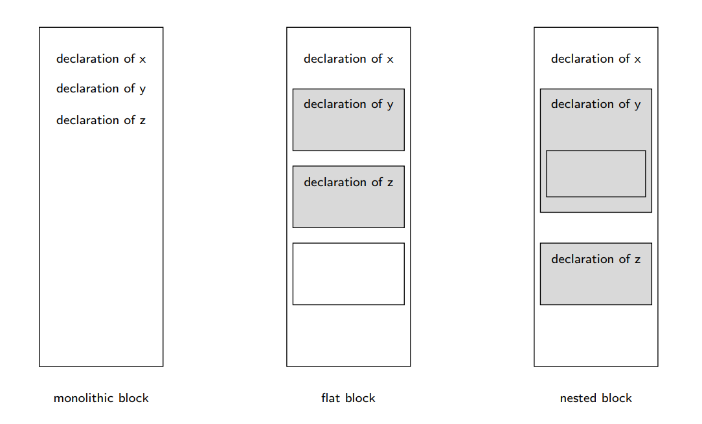

# Data, Types and Scope
-------------
## Types
A set of values
If we say x is of type T then we are implying the x ∈ T.
If an expression E is of type T then we are implying that when E is evaluated the result of that would be of type a T.
Each operation associated with a type must act uniformly when applied to all values of the type.
Types are sets that defined by the values the set contains and the
operations on these values.
### Primitive Types
cannot be decomposed into simpler values.
- **Boolean**
    - 2 values, _true_ or _false_ or predefined values, (eg in C, 0 is false else is true)
- **Character**
    - language defined or implementation defined _set of characters_ (ASCII, ISO Latin, UNICODE).
- **Integer**
    - language defined or implementation defined _range of whole numbers_.
    - defined by the target computer's word size and integer arithmetic capabilities 
- **Floating**
    - language defined or implementation defined _subset of real numbers_.
    - determined by the target computer's word size and floating-point arithmetic capabilities. 

#### Discrete Primitive Type:
one-to-one mapping with the range of integers.

### Composite Types
A type whose values are composed from simpler values. Fancy name for a data structure.
#### Cartesian Products
eg. tuples, records
The notation (x,y) whose first value is x and the second value is y.
- **Basic Operations**
    - **construction**
    - **selection**

- **Cardinality** 
    - \#(S x T) = \#S x \#T
#### Mapping
eg. arrays
The notation
m: S &rarr; T
represents a mapping m from set S to set T (every value in S is mapped to a value in T)
An indexed sequence of elements with one element of T for each index (from S)
- **Basic Operations**
    - **construction**
    - **indexing**

- **Cardinality**
    - \#(S &rarr; T) = \#(T)<sup>\#S</sup>

#### Disjoint Unions
eg. algebraic types, discriminated records and objects.
Selected from one of several, possibly different,sets.
The notation
S + T
represents a disjoin union of sets S and T.
Each element of S + T consists of a tag which identifies which original set the element came from and a variant which is the value from the original set.
- **Basic Operations**
    - **construction**
    - **tag test**
    - **projection**
#### Recursive
eg. lists and trees.
A type that is defined in terms of iteself.
Recursive types occur in:
- **Lists**:
    If elements in list are the same type it is homogeneous, else hetrogeneous.
    - **Basic Operations**
        - construction
        - length
        - empty test
        - head selection
        - tail selection
        - concatentation
- **Strings**:
    A sequence of characters.
    - **Basic Operations**
        - length
        - equality test
        - lexicographical comparison
        - character selection
        - substring selection
        - concatentation

### Type System

### Static vs. Dynamic Scoping
#### Statically Scoped
- the body of a procedure is executed in the environemnt of the _procedure's definition_.
- **Binding Occurence:** examining the program's source code.

#### Dynamically Scoped
- the body of a procedure is executed in the environment of the _procedure's call_.
- **Binding Occurence:** run-time.

## Declaration
A declecration produces a binding between an identifier and an entity.
### Type Declaration
- **Type Definition:** binds an identifier to an exisiting type/
- **New-type Definition:** binds an identifier toa new type.

## Syntax vs Semantics
### Syntax
Define how statements are form in a language.
Made up of:
    - _**lexical rules**_: define the alphabet of the language and how these characters are combined to form valid words.
    - _**syntax rules**_: define how valid words ar combined to form valid statements. 
- The _form_ or _structure_ of the expressions, statements, and program units.
- Context free grammars
- Regular expressions
eg: Traffic Light: green(bottom);yellow;red

### Semantics
Defines the meaning of a program.
Two ways of formally specifying the sematics of a language:
    - **Axiomatic Semantics**: defines the execution of a program in terms of a state machine
    - **Denotational Semantics**: specifies each language statement in terms of mathematical objects.

- The meaning of the expressions, statements and program units.
- Interpreter
- Compiler
eg: green=go;...;red = stop

## Bindings and Enivronments
### Binding
A fixed association between an identifier and a variable, value or procedure.
Setting the value of an attribute.

|   | |
|:-: |:-:	|
| **Language Definition Time Binding** 	| Static Binding	|
| **Language Implementation Time Bindings** 	| Static Binding 	|
| **Compile-Time Bindings** 	| Static Binding 	|
| **Execution-Time Bindings** 	| Static Binding 	|
### Environment
(namespace) a set of bindings.

### Scope
The scope of a _decleration_ is the section of the programme text in which the decleration is in effect.

The scope of a _binding_ is the section of the programme text in which the binding is applied.

## Blocks
A construct that delimits the scope of any declaration within it.
- #### C:
    - ({...})
    - function bodies
    - whole programme itself
- #### Java:
    - ({...})
    - method bodies
    - whole programme itself
- #### Python:
    - function bodies
    - method bodies
    - class definitions
- #### Ada:
    - commands
    - procedure bodies
    - whole programme itself

| **Monolithic Block Structure** 	| **Flat Block Structure**	| **Nested Block Structure**	|
|:-: |:-:	|:-:	|
| The whole programme is the only block 	| The programme is partitioned in several non-overlapping blocks. 	|  Blocks may be nested within other blocks	|



### Block Command
a command that contains a local declaration D (or a group of declarations) and a subcommand C. The binding produced by D are only in effect for the execution of C. (**{}** (java))

### Block Expression
An expression that contains a local declaration d (or a group of declaration) and a subexpression E. The binding produced by D are only in effect for the evaluation of E (**let** (haskell))

# Pointers and Memory Management
-------------
### Managing Dynamic Memory
#### Allocate memory
- request a block of memory big enough to a defined data element. 
- run-time system allocates a sufficient block of memory for the memory pool and returns a pointer to the allocated block and returns the pointer to the allocated block
#### Release memory
(where languages differ)
- the allocated memory is released back to the memory pool.
    - **C:** programmer controls the release of memory
    - **C++:** a mix of programmer control and data structure lifetime
    - **Java:** automatic, garbage collection

```C
int main()
{
    // This pointer will hold the 
    // base address of the block created 
    int* ptr; 
    int n, i; 
  
    // Get the number of elements for the array 
    n = 5;
  
    // Dynamically allocate memory using malloc() 
    ptr = (int*)malloc(n * sizeof(int)); 
  
    // Check if the memory has been successfully 
    // allocated by malloc or not 
    if (ptr == NULL) { 
        printf("Memory not allocated.\n"); 
        exit(0); 
    } 
    else { 
  
        // Memory has been successfully allocated 
        printf("Memory successfully allocated using malloc.\n"); 
  
        // Get the elements of the array 
        for (i = 0; i < n; ++i) { 
            ptr[i] = i + 1; 
        } 
  
        // Print the elements of the array 
        printf("The elements of the array are: "); 
        for (i = 0; i < n; ++i) { 
            printf("%d, ", ptr[i]); 
        } 
        ptr = *n
        // do something.... memory leak
    } 
    return 0; 
} 
```
### Garbage Collection
Java garbage collecction

- Whenever the **new** operator is called to create a new object, sufficient memory is allocated from the heap (memory used to store Java objects).
- The **new** operator returns a _reference_ to the allocated heap memory.

Major approaches:
#### Reference Counts
- The reference count increments whenever a block of allocated heap memory is assigned to a memory.
- The reference count decremets when a variable contains a reference to a block of allocated heap memory goes out of scope (function finishes).
- When the reference count for a block of heap memory becomes zero, the block of memory can be used for garbage collection.

#### Mark and Sweep
- **_Stop-the-World_ events**: all activities/threads are suspended until the garbage collection finishes
- **Mark**:
    - starts with every garbage collection root:
        - local varialbes and inpur parameters of currently executing module
        - active threads
        - static fields of loaded classes
        - JNI references
    - traverses the object graph from the garbage collection roots, every object visited is marked as alive.
- **Sweep**: unmarked objects are available for garbage collection, and are returned to the heap.
- **Compaction**: remaining allocated blocks are in contigious block of memory at the start of the heap. Easier to allocate memory to new object.
- **Generational**

# Abstractions
-------------
- allows us to focus on general ideas rather than specific manifestations of these ideas.
- hides all but the relevant data about an object in order to reduce complexity and increase efficiency.

### Proper Procedure
- contains _command_ to be executed.
- when it is called it will update variables.
### Function Procedure
- contains an _expression_ to be evalutated 
- returns a result.

### The Abstraction Principle
construct other types of procedures.
This states that it is possible to design procedures that abstract over any syntactic category, provided only that the constructs in the syntactic category specify some kind of computation.

## Parameters and Arguments

An **argument** is a value that is passed to a procedure.
An **_actual parameter_** is an expression that yields an arugment.
A **_formal paramenter_** is an _identifier_ through which a procedure can access an argument.

```python
class BankAccount:
    ....
    def processDeposit(self,deposit):
        self.currentAmount += deposit # deposit is the "formal parameter"

def main():
    myBankAccount = BankAccount()
    myBankAccount.processDeposit(200) # 200 is the "actual parameter"
```
### Parameter Passing Mechanisms
#### Copy Parameter Passing Mechanism
- binds the formal parameter to a local variable that contains a copy of the argument
    - **Copy-in**: a local variable is created and initialised with the value of the argument.
    - **Copy-out**: a local variable is created but not initialised.
    - **Copy-in Copy-out**: a local variable is created and initialised with the value of the argument.

#### Reference Parameter Passing Mechanism
- binds the formal parameter directly to the argument itself
    - **Constant parameter**: the argument must be a vvalue_ which is bound the formal parameter during the procedure's execution
    - **Variable parameter**: the argument must be a _variable_ which is bound the formal parameter during the procedure's execution
    - **Procedure parameter**: the argument must be a _procedure_ which is bound the formal parameter during the procedure's execution

## The Correspondence Principle
remove any unnecessary differences between declarations and parameter passing mechanisms.
States that for each form of delcaration there exists a corresponding parameter passing mechanism.

# Assertions and Exceptions
-------------
## Assertions
- typically tests that are performed at run-time.
- generates to an exception if evaluation is false.
- used to support two different approaches to software development, _**Design by Refinement**_ and _**Design by Contract**_.
- used to automatically generate test cases.

### Preconditions
A boolean condition that must hold (be true) when a method is called.
### Post-conditions
A boolean condition that must hold after a method completes successfuly.

## Design by Contract
Based on the principle that the classes of a system should communicate with one another on the basis of precisely defined benefits and obligations.
Uses pre-conditions and post-conditions to document the change in state caused by a piece of a program.

## Invariants
- _**Class invariants**_ must be true about each instance of a class (Design by Contract):
    - applies to every instance of a class at all times except when an instance is in transition from one consistent state to another.
    - specify the relationships among multiple attributes
    - should be true before and after any method completes.
    Example:
    - Implementing a balanced tree data structure.
    - A class invariant could be that the tree is balanced.
    - This could be implemented as a private method checking that the tree was balanced.
- _**Loop invariants**_ must be true in each iteration of a loop (Design by Refinement):
    -


## Exceptions
Abnormal situations that prevent the program from continuing normally.

# Object Oriented Programming
-------------
## Inheritance
A _subclass_ inherits the member variables and methods from its _superclass_. 
It may override the superclass's methods by providing a more specialised version of these methods.

### Dynamic Dispatch
Dynamic dispatch is the mechanism that allows _polymorphic operations._
When the appropriate method is invoked to a type of object after examiniation.

# Logic Programming Paradigm
-------------
## Mapping vs. Relations
- Prolog: based on the concept of relations (many-to-many replationship)
- Relations are a more general concept than mappings

#### Mappings
ask:
Given _a_, determine _m(a)_.

#### Relations
ask:
Given _a_ and _u_, determine _r(a,u)_ is true.
Given _a_, find all the values _y_ such that, _r(a,u)_ is **true**.
Given _u_, find all the values a such that, _r(a,u)_ is **true**.
Find all the values _x_ and _y_ such that _r(x,y)_ is **true**.

**Based on the following three concepts:**

### Assertions
form:
r(T<sub>1</sub>,...,T<sub>n</sub>)
- r is an n-ary relation
- T<sub>1</sub>....,T<sub>n</sub> are _terms_ that can contain variables

```prolog
white(255, 255, 255).
black(0, 0, 0).
blue(27, 0, 230).
red(230, 0, 0).
```
### Horn Clauses
**A logic program is a collection of Horn clauses**
form
A<sub>0</sub> if A<sub>1</sub> and .. and A<sub>n</sub>
if A<sub>1</sub> and .. and A<sub>n</sub> are **true** then A<sub>0</sub> is _**true**_
A _fact_ is a specifal case of Horn clause where n=0. A<sub>0</sub> is unconditionally _true_.

```prolog
grandmother(X,Z) :- mother(X,Y), parent(Y,Z).
grandchild(Z,X) :- mother(Z,Y), parent(X,Y).
```

### Relation
- defined in terms of simpler relations.
- no procedures.
- a typical logic program consists of a vast number of relations.

## Bindings and Scope
- The scope of a relation is the entire program
- The scope of a variable is the whole clause in which it occurs.

every variable is either:
### Universally Quanitified
- a variable the occurs in the left-hand side of a clause.

### Existentially Quantified
- a varialbe the occurs in the righh-hand side of a clause.
- a variable that occurs in a query.

## Cut
A special sequencer in Prolog called cut, _**!**_ that control _**backtracking**_.
- always succeds
- has the effect of freezing any assignments of values to variables that occured before the cut.

## Database Manipulation
Prolog stores all its clauses (facts and rules) in its own internal database:
    - Four database manipulation commands:
        - **asserts**: add clauses to the end of the database 
        - **asserta**: adds clauses to the start of the database
        - **assertz**: add clauses to the end of the database
        - **retract**: removes a matching clause from the database
    - Always succeed

Database manipulation commands give us the ability to:
    - **Dynamic Predicates**: change the meaning of predicates while we are running programs.
    - **Memoisation**: store the results to computation.

# Functional Programming
-------------
## Key Concepts
- ### Expressions
    - computes new values from old values
- ### Functions
    - first class values
    - abstract over expressions
    - can be passed as arguments to functions and computed as a results off other functions
    - higher-order function: one that takes other functions as arguments or computed another functions as a results
    - can be built into composite values
- ### Parametric Polymorphism
    - a function operates on values of a type family rather than just one type
- ### Data Abstrations
- ### Lazy Evaluation
    - relates to when an expression is evaluated.
    - order of evaluation:
        - Eager Evaluation: 
            - evaluate at the point of call.
            - to substitute the actual argument value for each occurence of the formal parameter.
        - Normal-order evaluation:
            - evaluate the actual parameter only when the argument is actually needed
            - to substitute the actual _unevaluated_ parameter for each occurence of the formal parameter
        - Lazy evaluation:
            - evaluate the actual parameter when the argument is _first_ needed and then store its value for whenever it is subsequently needed.

## Haskell: Higher Order Functions
A function that has functional parameters or functional results.

In Haskell functions:
- are _**first-class values**_.
- can be passed as parameters
- can be computed as function results
- built into composite values

```haskell
power :: (Int,Float) ->Float
power (n,b)
    | n == 0 = 0.0
    | otherwise = b * power (x, b)
    where x = n - 1

powerc :: Int -> Float -> Float
powerc n b
    | n == 0 = 1.0
    | otherwise = b * powerc x b
    where x = n - 1
```
- Curried Function
- Partial Application

**filter**: computes a new list, keeping those elements x from the original list where f x is True.
**map**: computes a new list by applying a function f to all elements x of the original list.
**foldr**: recursively combines the first element with the results of combining the rest of the list.
**foldl**: recursively combines the last element with the results of combining the previous elements of the list.


