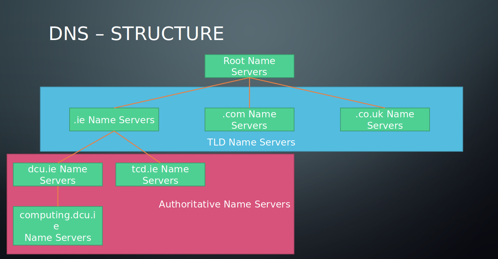
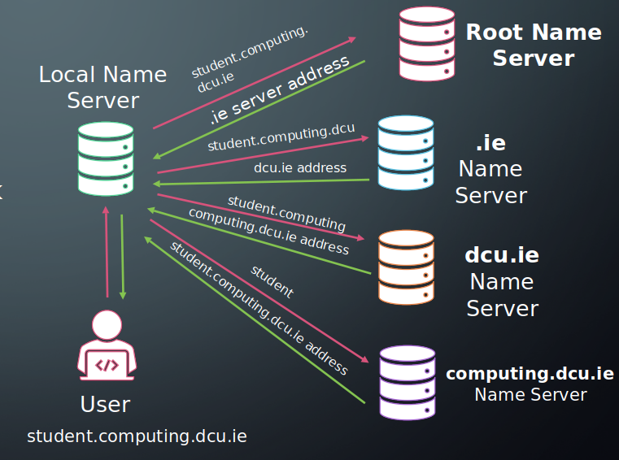
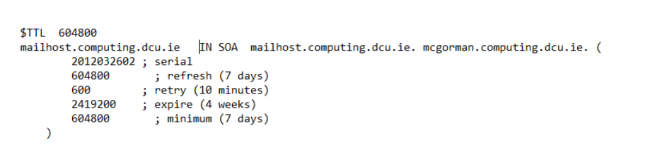

# Supernetting & Subnetting IPV6 Addresses

## IPV4 Classes
- IP addresses are 4 bytes (32 bits)
- 2<sup>32</sup> = 4,294,967,296 Total number of IP addresses (~4 Billion)
- Divided in 5 blocks/classes: **A-E**.
    - Divided into network and host
    - Different ranges are assigned to network and host (depending on class)

| Class        | Prefix           | #Network bits  | #Host bits  | Range  |
| ------------- |:-------------:| -----:| -----:| -----:|
| A      | 0 | 7 | 24 | 0.0.0.0 – 127.255.255.255 |
| B      | 10      |   14 |   16 | 128.0.0.0 – 191.255.255.255 |
| C | 110      |    21 |    8 | 192.0.0.0 – 223.255.255.255 |
| D | 1110      |    N/A |    N/A | 224.0.0.0 – 239.255.255.255 |
| E | 1111      |    N/A |    N/A | 240.0.0.0 – 255.255.255.255 |

- #Prefix + #Network + #Host = 32
- Class D is reserved for **multicasting**.
    - sending packets to multiple IP addresses.

_**How many networks per class?**_
\#networks = 2<sup>_network bits_</sup>

_**How many hosts per network?**_
\#host = 2<sup>_host bits_</sup>
- How many IP addresses you have control over

_**How many addressable hosts per class?**_
\#addressable hosts = \#hosts - 2 
2 are reserved:
- **Network address**:
    - address of the network
    - first host address eg. 136.206.0.0
- **Broadcast address**:
    - sends a packet to every host on the network
    - last host address eg. 136.206.255.255

```python
# DCU addresses are 136.206.x.x
# What class?
DCUClass = "B"
# How many networks does this class have?
noClassB_Networks = 2 ** 14
# How many hosts on DCU network?
noDCUHosts = 2 ** 16 
```
## Subnetting
- Reduces network traffic
    - Routers make smaller broadcast domains (limits span)
- Optimizes NW performance
    - Less traffic
- Simplifies management
    - Easier to do fault analaysis
- Facilitates spanning large physical areas

### Creating Subnets
- Address spaces:
    - **IP address** (normal):
        - [network, host]
    - **Subnetted IP address**:
        - [network, subnet, host]
- **Subnet mask**: used to tell the difference between the network part of an address and the host part.

#### Classes & Default Subnets

| Class        | Format           | Default Subnet Mask  |
| ------------- |:-------------:| -----:|
| A      | nw.host.host.host | 255.0.0.0 |
| B      | nw.nw.host.host | 255.255.0.0 |
| C | nw.nw.nw.host | 255.255.255.0 |

```python
classASubnetMask = "255.0.0.0"
classASubnetMaskBinary = "11111111.00000000.00000000.00000000"
# There are 8 "1s" in classASubnetMaskBinary 
# Classless Inter-Domain Routing
cidrNotation = "255.0.0/8"

```

```python
Network = "192.168.10.0"
subnetMask = 192
networkSubnet = "255.255.255.192/26"
networkSubnetBinary = "11111111.11111111.11111111.11000000"

# How many subnets on this network?
# subnet networks = 2 ** number of "1" subnet bits
subnetNetworks = 2 ** 2

# How many hosts per subnet?
# subnet hosts = (2  ** number of zeros) - 2
subnetHosts = (2 ** 6) - 2

# What are the valid subnets?
# valid subnets = 256 - subnet mask
blockSize = 256 - subnetMask # 64
validSubnets = [i + blockSize for i in range(-blockSize,subnetMask,blockSize)] # [0,64,128,192]

# What is the broadcast address of each subnet?
subnet0 = 63
subnet64 = 127
subnet128 = 191
subnet192 = 255 # Broadcast address of last subnet is always 255
# What are the valid hosts?

```

# Routing

## RIP - Routing Information Protocol
- Distance Vector Routing Protocol
- Prevents count to infinity by limiting the number of hops over a netowkr
- Easier to configure
- Messages sent with UDP
- Time convergence (therefore not used)

## OSPF - Open Shortest Path First
- Dijkstras Shortest Path
- Fully classless
- Dimensionless arbitrary metric (route cost)
- Updates via multicase (not broadcast)
- Has authenication
- Tag external routes


# DNS - Domain Name System
A server (DNS server) with a database of IP adrresses

```python
#DNS Loopup or DNS resolve
DNSServer = getDNSDatabase()
DomainName = input()
ipAddress = DNSserver[DomainName]
```

## DNS Structure

The DNS database is:
- **Distributed**:
    - split in parts and distrubted across the globe.
- **Structured**:
    - has rules guiding the part of the database each server has.
- **Replicated**:
    - multiple copies of each database exist.



### Root Name Server
- contacted first.
- finds ip address of domain.
- decides which Top-Level Domain server to forward the request to.

### Top-Level Domain Name Servers
- manages the DNS mappings for top level domain (eg. .com, .ie, .org)

### Authoritative Name Servers
- DNS mappings by an organisation (eg. HEANET manage the network infrastructures ofr thrid levbel universities in Ireland).
    - contains DNS mappings for DCU, TCD, etc..
- Can be DCU itself (mappings for computing.dcu.ie eg for student.computing.dcu.ie)

### Local Name Servers
- local name servers.
- The local name server caches the addresses of common domains.

## Address Resolution



## Records

### Optimisation
- local name server try to cache the usually suspects  eg. google.com, facebook.com
- stored as DNS records
- buying a domain name, will give ability to edit your dns records.

### Types

| Types       | Name           | Role
| ------------- |:-------------:| :-------------:|
| A      | Addresses | Used to resolve hostnames to IP addresses |
| CNAME      | Canonical Name      | Used to provide aliases to hostnames |
| MX | Mail eXchange (email servers)      | Used to resolve the mailserver address |
| NS | Name Servers      | Used to list the nameservers managing this domain |
| PTR | Pointer Record (for reverse dns lookup)      | Used to provide an address which can resolve the reverse DNS lookup |

### SOA Record
Contains _**administrative info**_ about the DNS zone (server)



```
$TTL 604800 = TTL for cached data
mailhost.computing.dcu.ie = Name of the zone
IN SOA = SOA record
mailhost.computing.dcu.ie = Nameserver
mcgorma.computing.dcu.ie = Admin email
2012032602 = Serial, increment when the zone file is updated
884800 = refresh (7 days), When this file should be refreshed from the master
600 = retry (10 minutes), How long before retrying connection if there is no response
2419200 = expire (4 weeks), When the zone data is no longer authoritative, used by slave dns servers
604800 = Negative cache TTL – caching error responses, e.g. 404
```

# Spanning Trees

- Switches replace many routers in modern LAN and Enterprise Networks.
- Operate on MAC Addresses
- Self configuirng networks
- Need: loop free networks and problem avoidance
- Redundancy and fault tolerance (nice to have)

## Spanning Tree Protocol (STP)
- Creates a spanning tree within a mesh network or graph of layer-2 bridge, disabling edges which are not part of the tree.
- One path between any two nodes.
- Loops are eliminated.
- Allow reorginasation of links in case of a link failure.

## SDP Operation Summary
- **Root Bridge**: Elect ROOT bridge (ID = Priority + MAC Address)
- **Root Port**: Other bridges determine a least cost path to the root bridge, the port used is a **root port**.
- **Disable**: Disable all other possible root paths (make a tree).
- Rules
- **Designated port** chosen as port linking that segment to the root (shortest to it).
- **Forwarding State**: Root ports or designated ports enter this state and carry traffic.
- **Blocking State**: Other ports (else) will entter this state. Only BPDU can transmit or recieve any traffic.
- **BDPU**: used as control and information frames to assist protocol operation, bridge IDS, route costs, port numbers etc.

# Firewall
A barrier that prevents **unauthorised** or **unwanted _communication_** between sections of a computer network.
- Protects our LAN from unauthorised access
- Allow shh access from specified ip addresses (whitelisting)

## Firewall Tech

### 1st Generation
- Stateless packet filter
- Filter packets on:
    - Source/destination IP
    - Protocol (TCP/UDP)
    - Port Number
- When a filter is created possible actions are:
    - DROP:
        - Silently discard packet
    - REJECT:
        - Discard with error response
    - ACCEPT:
        - Route the packet (tells where to go)

### 2nd Generation
- Stateful packets
- Filter packets on:
    - Source/destination IP
    - Protocol (TCP/UDP)
    - Port Number
    - Existing/New Sessions
- Packet filters can determine a packets positional in a protocol stream. (packet from new connection,new connection)
- DROP/REJECT/ACCEPT accordingly

### 3rd Generation
- Application later
- Filter packets on:
    - Source/destination IP
    - Protocol (TCP/UDP)
    - Port Number
    - Existing/New Sessions
    - FTP
    - DNS
    - HTTP
    - HTTPS
- Filter per process (not port)
- Process rulesset
- DROP/REJECT/ACCEPT accordingly

## Firewall Types
### Application Layer
- Work on a process basis
- Allow/restrict network access
- Allow restrict system calls to OS

### Packet Filters
- Inspects packets going to/from a network
- Checked again a series of rules
- Each rule contains actions

### Poxy Firewall
- Gateway between networks
- Proxy server where all traffic to and from a network pass through
- Common rules (IP whitelisting/blacklisting)

### IPTABLE
example rules
```bash
sudo iptables -A INPUT -i lo -j ACCEPT

sudo iptables -A INPUT -m state --state ESTABLISHED -j ACCEPT

sudo iptables -A INPUT -p tcp -s 0/0 -d 192.168.20.1 --dport 80 –j ACCEPT

sudo iptables –A INPUT –j DROP
```