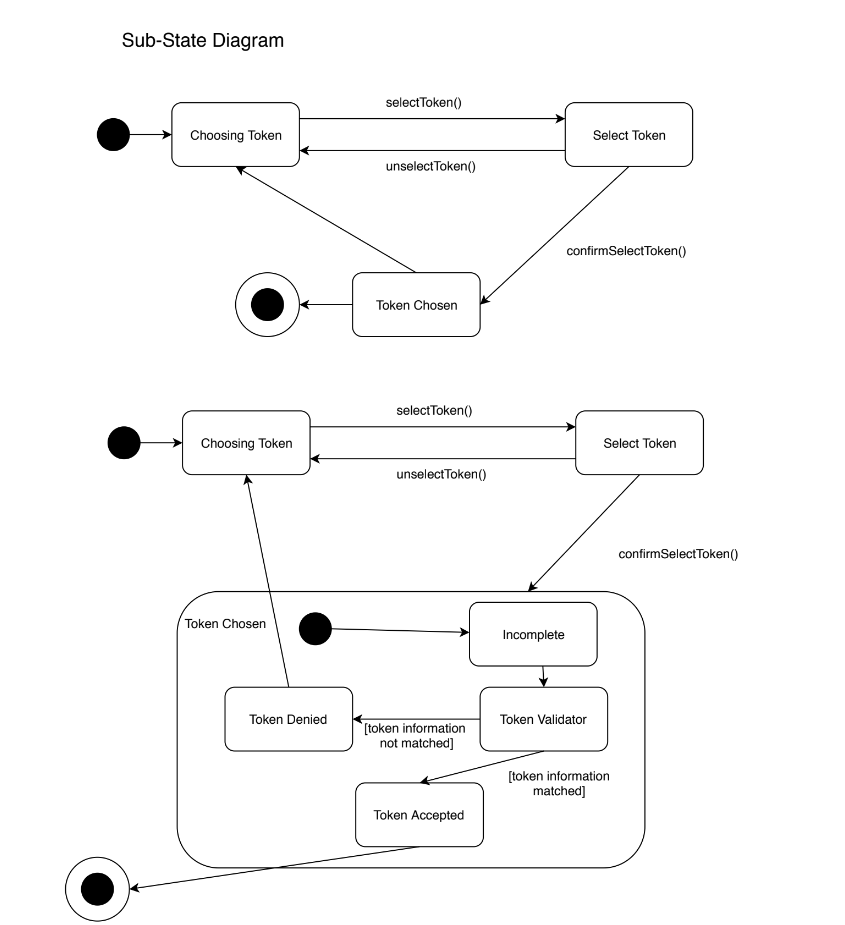

# SOLID

The SOLID principles are _**five** dependecy management_ for OOP and design.

- ### Single Responsibility Principle (SRP):
    - Classes should:
        - **NEVER** have more than one reason to change.
        - Have a single purpose.
    #### Advantages
    -  Classes become smaller and cleaner.
    - Simpler code to understand and maintain.

    #### Violates SRP
    ```C#
    public class OxygenMeter
    {
        public double OxygenSaturation { get; set; }
    
        public void ReadOxygenLevel()
        {
            using (MeterStream ms = new MeterStream("O2"))
            {
                int raw = ms.ReadByte();
                OxygenSaturation = (double)raw / 255 * 100;
            }
        }
    
        public bool OxygenLow()
        {
            return OxygenSaturation <= 75;
        }
    
        public void ShowLowOxygenAlert()
        {
            Console.WriteLine("Oxygen low ({0:F1}%)", OxygenSaturation);
        }
    }
    ```
    #### Refactored Code
    ``` C#
    public class OxygenMeter
    {
        public double OxygenSaturation { get; set; }
    
        public void ReadOxygenLevel()
        {
            using (MeterStream ms = new MeterStream("O2"))
            {
                int raw = ms.ReadByte();
                OxygenSaturation = (double)raw / 255 * 100;
            }
        }
    }
    
        
    public class OxygenSaturationChecker
    {
        public bool OxygenLow(OxygenMeter meter)
        {
            return meter.OxygenSaturation <= 75;
        }
    }
        
    
    public class OxygenAlerter
    {
        public void ShowLowOxygenAlert(OxygenMeter meter)
        {
            Console.WriteLine("Oxygen low ({0:F1}%)", meter.OxygenSaturation);
        }
    }
    ```

    - ### Open/Closed Principle:
        - Software entities (classes, modules, functions, etc.) should:
            - be open for extension but closed for modification.
                - **Closed**: should only be _adjusted_ to correct bugs
                - **Open**: should only extend existing code in order to introduce _new functionality_.
        #### Advantages
        - reduces the risk of introducting new bugs to existing code (robust software)
        - reduced coupling and increased flexibility

    #### Violates OCP
    ```C#
    public class Logger
    {
        public void Log(string message, LogType logType)
        {
            switch (logType)
            {
                case LogType.Console:
                    Console.WriteLine(message);
                    break;
    
                case LogType.File:
                    // Code to send message to printer
                    break;
            }
        }
    }
    
    
    public enum LogType
    {
        Console,
        File
    }
    ```  
    #### Refactored Code  
    ```C#
    public class Logger
    {
        IMessageLogger _messageLogger;
    
        public Logger(IMessageLogger messageLogger)
        {
            _messageLogger = messageLogger;
        }
    
        public void Log(string message)
        {
            _messageLogger.Log(message);
        }
    }
    
    
    public interface IMessageLogger
    {
        void Log(string message);
    }
    
    
    public class ConsoleLogger : IMessageLogger
    {
        public void Log(string message)
        {
            Console.WriteLine(message);
        }
    }
    
    
    public class PrinterLogger : IMessageLogger
    {
        public void Log(string message)
        {
            // Code to send message to printer
        }
    }
    ```
- ### Liskov Substitution Principle (LSP):
    states that "functions that use pointers or references to base classes must be able to use objects of derived classes without knowing it".

    - states that subclasses should be able to substitute for their base classes.
    If you create a class with a dependency of a given type, you should be able to provide an object of that type or any of its subclasses without introducing unexpected results and without the dependent class knowing the actual type of the provided dependency. If the type of the dependency must be checked so that behaviour can be modified according to type, or if subtypes generated unexpected rules or side effects, the code may become more complex, rigid and fragile.

- ### Interface Segregation Principle (ISP):
    - Clients should not be forced to depened upon interfaces that they do not use.
        - When one class depends upon another, the number of members in the interface is is visible to the dependent class should be minimised.
    #### Advantages
    - Class and their dependencies communicate using tightly-focused inferfaces, minimising dependencies on unused members and reducing coupling accordingly
    - Easier to implement
    - Improve flexibility and the possbility of reuse.
    - Robustness increase

    #### Violates ISP
    ```C#
    public class Contact
    {
        public string Name { get; set; }
        public string Address { get; set; }
        public string EmailAddress { get; set; }
        public string Telephone { get; set; }
    }
    
        
    public class Emailer
    {
        public void SendMessage(Contact contact, string subject, string body)
        {
            // Code to send email, using contact's email address and name
        }
    }
    
        
    public class Dialler
    {
        public void MakeCall(Contact contact)
        {
            // Code to dial telephone number of contact
        }
    }
    ```
    #### Refactored Code
    ```C#
    public interface IEmailable
    {
        string Name { get; set; }
        string EmailAddress { get; set; }
    }
    
    
    public interface IDiallable
    {
        string Telephone { get; set; }
    }
    
    
    public class Contact : IEmailable, IDiallable
    {
        public string Name { get; set; }
        public string Address { get; set; }
        public string EmailAddress { get; set; }
        public string Telephone { get; set; }
    }
    
    
    public class MobileEngineer : IDiallable
    {
        public string Name { get; set; }
        public string Vehicle { get; set; }
        public string Telephone { get; set; }
    }
    
    
    public class Emailer
    {
        public void SendMessage(IEmailable target, string subject, string body)
        {
            // Code to send email, using target's email address and name
        }
    }
    
    
    public class Dialler
    {
        public void MakeCall(IDiallable target)
        {
            // Code to dial telephone number of target
        }
    }
    ```

- ### Dependecy Inversion Principle (DIP):
    - High level modules should not depend upon low level modules.
    - High level modules and low level modules should depend upon abstraction.
    - Abstraction should not depend upon details.
    - Details should depend upon abstractions.

    #### Advantages
    - Loosely coupled increases robustness of the software
    - Improves flexibility
    - Raise possibilty of reuse
    - Without DIP only low level classes can be easily reusable
    
    #### Violates DIP
    ```C#
    public class BankAccount
    {
        public string AccountNumber { get; set; }
            
        public decimal Balance { get; set; }
    
        public void AddFunds(decimal value)
        {
            Balance += value;
        }
    
        public void RemoveFunds(decimal value)
        {
            Balance -= value;
        }
    }
    
    
    public class TransferManager
    {
        public BankAccount Source { get; set; }
    
        public BankAccount Destination { get; set; }
    
        public decimal Value { get; set; }
    
        public void Transfer()
        {
            Source.RemoveFunds(Value);
            Destination.AddFunds(Value);
        }
    }
    ```
    #### Refactored Code
    ```C#
    public interface ITransferSource
    {
        void RemoveFunds(decimal value);
    }
    
    
    public interface ITransferDestination
    {
        void AddFunds(decimal value);
    }
    
    
    public class BankAccount : ITransferSource, ITransferDestination
    {
        public string AccountNumber { get; set; }
    
        public decimal Balance { get; set; }
    
        public void AddFunds(decimal value)
        {
            Balance += value;
        }
    
        public void RemoveFunds(decimal value)
        {
            Balance -= value;
        }
    }
    
    
    public class TransferManager
    {
        public ITransferSource Source { get; set; }
    
        public ITransferDestination Destination { get; set; }
    
        public decimal Value { get; set; }
    
        public void Transfer()
        {
            Source.RemoveFunds(Value);
            Destination.AddFunds(Value);
        }
    }
    ```

# Unified Modeling Language (UML)
A standerdized modelling language that enables developers to _**visualise**_, _**construct**_, and _**document**_ artifacts of a software system.

### State Machines


**states**: round boxes
**transitions between states**: arrows
**events that cause transitions**: message on transition arrows
**start marker**: black blob
**stop marker**: black blob with ring

## Packages
Packages are used for:
    - **Convenience** (eg. to hide irrelevant detail)
    - **Allocate** work among team members
    - **Specify** and design a component

# Correctness and Sufficiency

## Correctness
Each part of the software or related to it satisfies the designated requirements and that together they satisfy all of the application's requirements

# Flexibility, Re-Usability, Efficiency

## Flexibility
1. Adding more of the same kind of functionality.
    - eg: bank applications should be able to handle other kinds of accounts without changing existing design or code.
2. Adding different functionality.
    - eg. add withdraw functionality to esixting deposit functionality
3. Change functionality
    - eg. allow overdrafts

## Re-usability

Re-use of methods, classes and combinations.
Qualities to make a method re-usable:
    - Its usage is defined completely in terms of pre-conditions.
    - It is uncoupled as much as possible from its enclosing class.
    - Its algorithm is explained in detail.
Qualities to make a class re-usable:
    - A complete class description
    - Class name and functionality match a real world concept
    - Reduced dependency on other classes


## Efficiency

1. Design for other criteria, Then cosider efficiency
    - make targeted changes to improve efficiency
2. Design for efficiency from the start
3. Combine (1) and (2)

### Trading off Robustness, Flexibility, Efficiency, Re-usability
1. (A) Extreme Programming Approach (Design for Sufficiency only) OR
1. (B) Flexibility-Driven Approach (Design for future requirements; Re-use should be a by-product)
2. Ensure Robustness
3. Provide enough Efficiency (Compromise re-use etc as necessary to attain efficiency requirements)
