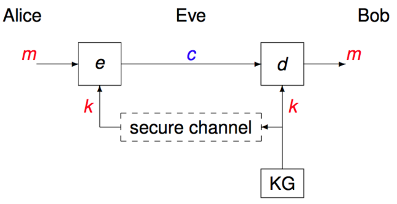
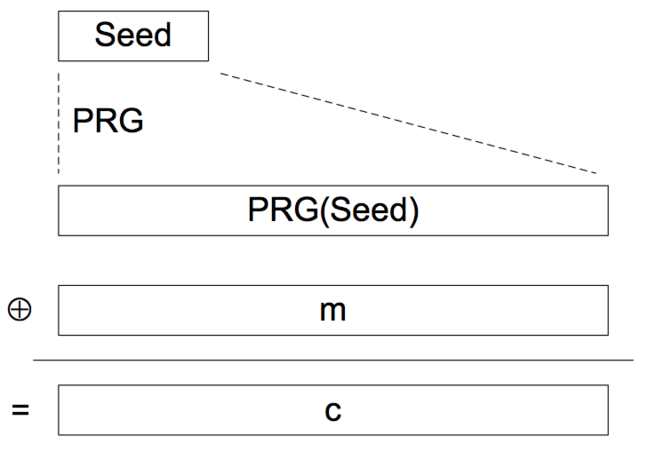

# Symmetric Cryptography

- same key is used to encrypt and decrypt the data.
- algorithm is not kept a secret.

There are two types of symmetric cipher:

### Stream Ciphers
encrypt an arbitrary stream of data. Depending on the cipher, the data may consist of a stream of bits or a stream of bytes. Each plaintext bit (or byte) encrypts to a different ciphertext bit (or byte) depending on what data occurred earlier in the stream.

### Block Ciphers
encrypt one block of data at a time. Typically, blocks consist of 64 bits (8 bytes) or 128 bits (16 bytes) of data. By default, the same plaintext block always encrypts to the same ciphertext block. In certain circumstances, this is a weakness, and we need to use some sort of feedback to disguise patterns in the plaintext. This leads to different modes of operation depending on the type of feedback used.

-----

## Stream Ciphers
