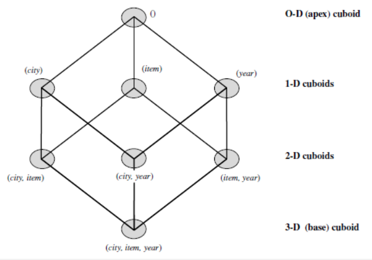

# Cube Computation

In SQL terms, aggregations are reffered to as **group-by's**.
A group-by can be represented as a cuboid (the set of group-by's froms a lattice of cuboids, defining a data cube).

## The Curse of Dimensionality

### Excessive Storage Space
 computes aggregates over all subets of the dimensions specified in the operation. This can require excessive storage space.

**Example**
AllElectronics
| City | Item | Year | Sales |
| -----| ----- | ----- | ----- |

with following possible analysis:
- Compute the sum of sales, grouping by city and item.
- Compute the sum of sales, grouping by city.
- Compute the sum of sales, grouping by item

Total Number of cuboids/group-by's from the following data cube:
with _city, item,_ and _year,_ as the **dimensions** of the data cube and _sales_ as the **measure** (total number of cuboids or group by's).
Formula:
2 # dimensions
Therefore:
23 = 8

with the follwing group-by's:
{ (city,item,year), (city,item), (city,year), (item,year), (city), (item), (year), () },

## Forming the Lattice

**O-D (apex) cuboid:** aggregate cell
**1-D cuboids:** aggregate cell
**2-D cuboids:** aggregate cell
**3D (base) cuboid:** base cell

## Lattice Components
**Apex cuboid (0-D cuboid):** 
- group-by is empty (all the sales since there is no group, so all possible sales).
- most generalised (least specific), **all**.
Drilling down: starting at the apex cuboid and explore downward in the lattice.

**3D (base) cuboid:**
- least generalised (most specific).
Rolling up: starting at the base cuboid and explore upward

## Choices for Data Cube Materialisation
**No materialisation:** Do not precompute any of the
nonbase cuboids.
- expensive and extremely slow.
**Full materialisation:** Precompute all of the cuboids.
- requires a huge amount of memory space.
**Partial materialisation:** Selectively compute a proper subset of the whole set of possible cuboids. Alternatively, compute a subset of the cube which only contains cells specified by the user (subcube).
