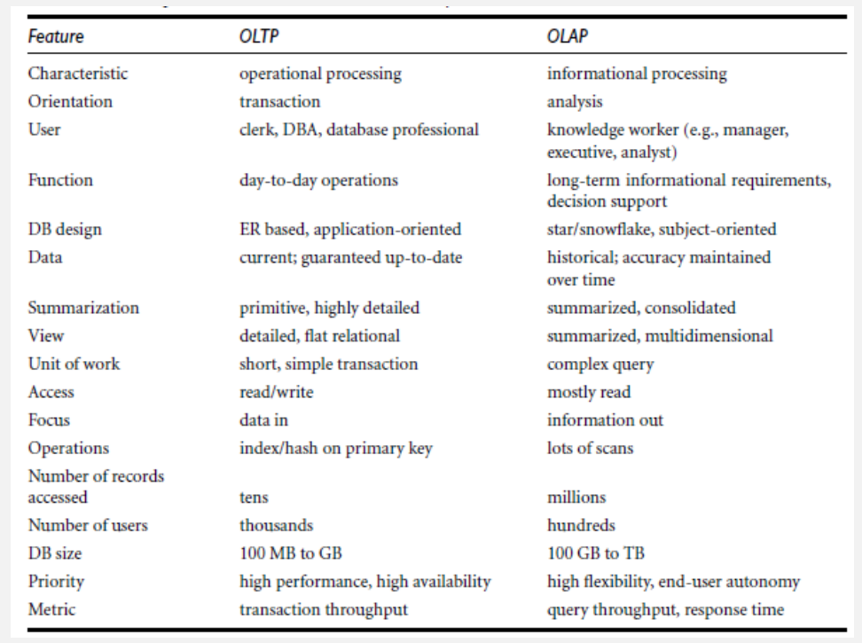
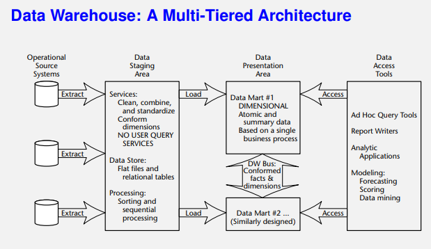

# Data Warehouse and OLAP Technology

Data Warehousing: The process of constructing and using data warehouses

### Immon's Definition
A data warehouse is a subject-oriented, integrated, time-variant, and nonvolatile collection of data in support of management’s decision-making process.

**Data Warehouse: Subject-Oriented**
- Organized around major subjects, such as customer, product, sales.
- Focusing on the modeling and analysis of data for decision makers, not on daily operations or transaction processing (excludes data that are not useful in the decision support process).

**Data Warehouse: Integrated**
- Constructed by integrating multiple, heterogeneous data sources relational databases, flat files, on-line transaction records. (Hotel price: currency, tax, breakfast covered, etc.)
- When data is moved to the warehouse, it is converted

**Data Warehouse: Time Variant**
- The time horizon for the data warehouse is significantly longer than that of operational systems
  - Data warehouse data: provide information from a historical perspective (e.g., past 5-10 years)
- Every key structure in the data warehouse
  - Contains an element of time, explicitly or implicitly
  - But the key of operational data may or may not contain time element

**Data Warehouse: Non-volatile**
- A physically separate store of data transformed from the operational environment.
- Operational update of data does not occur in the data warehouse environment.
-  two operations in data accessing: initial **loading** of data and **access** of data.

### OLTP (operational) vs OLAP (warehouse)

### Data Warehouse: A Multi-Tiered Architecture

#### Extraction, Transformation, and Loading (ETL)
**Data extraction:** get data from multiple, heterogeneous, and external sources
**Data cleaning:** detect errors in the data and rectify them when possible
**Data transformation:** convert data from legacy or host format to warehouse format
**Load:** sort, summarize, consolidate, compute views, check integrity, and build indicies and partitions
**Refresh:** propagate the updates from the data sources to the warehouse

### Cube: A Lattice of Cuboids

### Conceptual Modeling of Data Warehouses
Modeling data warehouses: **dimensions** & **measures**

#### Star schema
A fact table in the middle connected to a set of dimension tables.
Contains:
- Large central table (fact talble) containing tghe bulk of the data, with no redundancy
- Set of smaller attendant tables (dimension tables), one for each dimension.
- Resembles a starburst.

- Sales are considered along four dimensions: time, item, branch, and location.
- The schema contains a central fact table for sales that contains keys to each of the four dimensions.
- Contains two measures: dollars sold and units sold.

#### Snowflake schema
A star schema refinement where a dimensional hierarchy is normalised into a set of smaller dimension tables, forming a shape similar to a snowflake.

- The major difference between the snowflake and star schema models is that snowflake dimensions may use normalisation to reduce redundancies.
- Can reduce the performance, since more joins will be needed to execute a query.
- Reduces redundancy

#### Fact constellations
Multiple fact tables share dimensions, viewed as a collection of stars, called a galaxy schema or fact constellation.
-  can be viewed as a collection of stars, and hence is called a galaxy schema or a fact constellation.

